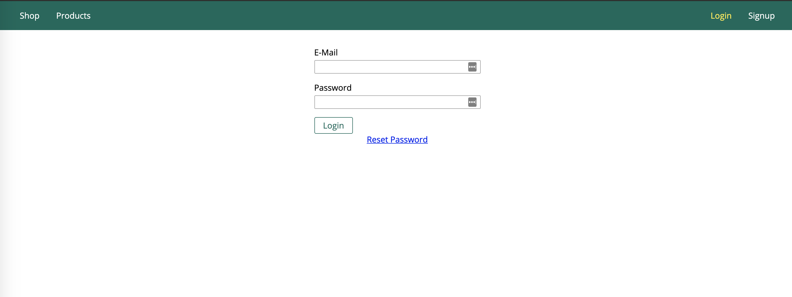
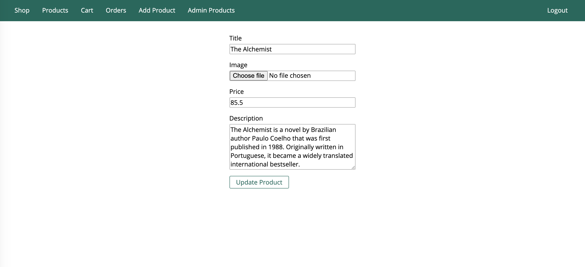
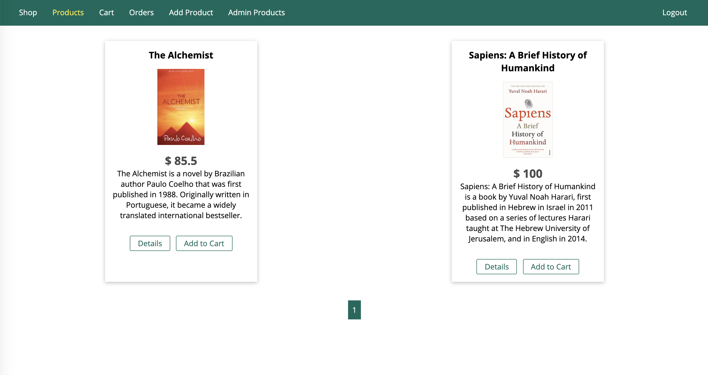
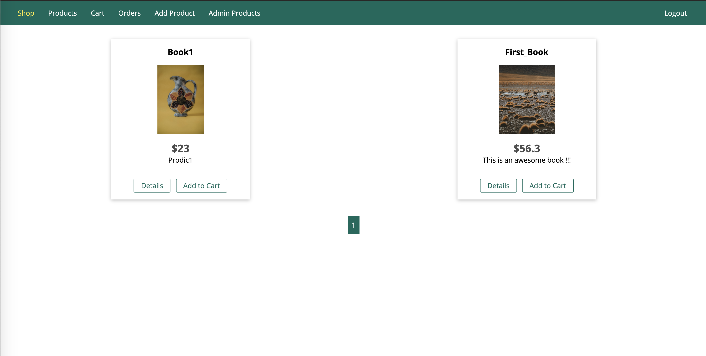
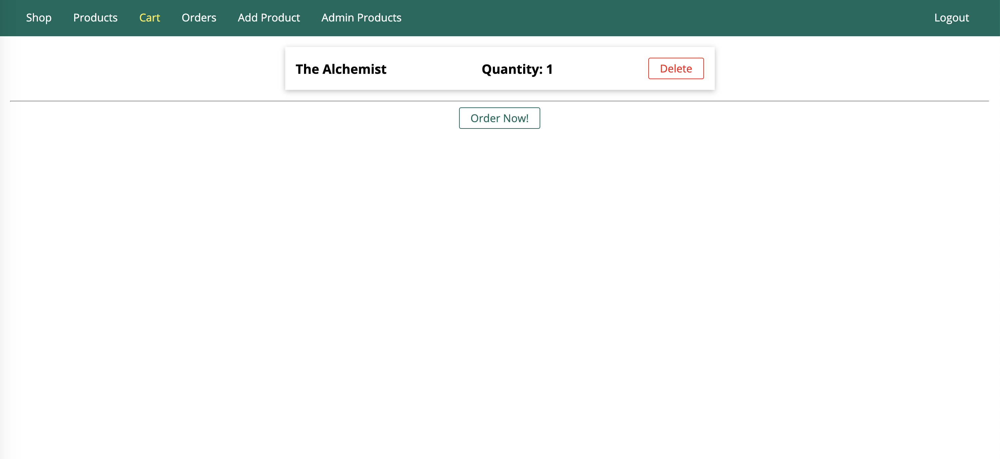
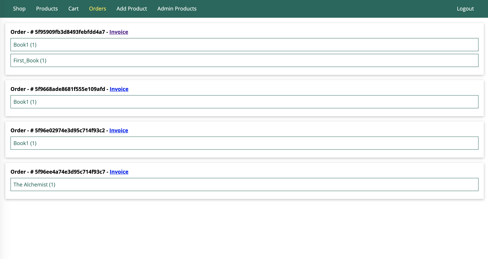

# Book Shopping

> Shop books online

## Table of contents

* [General info](#general-info)
* [Screenshots](#screenshots)
* [Technologies](#technologies)
* [Setup](#setup)
* [Features](#features)
* [Status](#status)

## General info

This application allows users purchase books online

## Screenshots

1.Login page

2.Admin Page to add products

3.Users shop page

4.Cart Page

5.Order details page

## Technologies

* Node JS
* Express Framework
* ejs templating engine
* MongoDb
* Mongoose ORM

## Setup

* Clone project from github
* Run `npm install` to install all dependencies
* Run `npm start` to start the server and application runs on port 3000

## Features

Features available for users,

* Login Functionality 
* Admin can manage the online store
* User can view book details
* User can add books to cart
* User can place an order and view order details

To-do list:

* Integrate stripe payment method

## Status

Project is: _in progress_